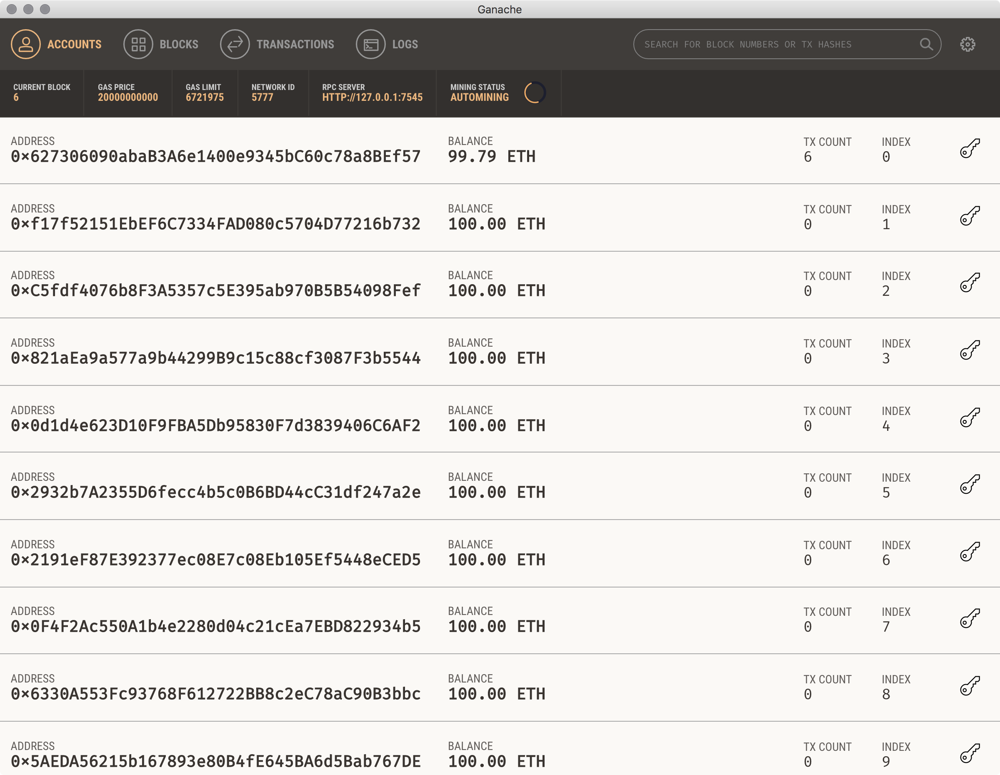

# introToken

A Solidity tutorial, made remarkably easy via [Truffle](https://github.com/trufflesuite/truffle), [OpenZeppelin](https://github.com/OpenZeppelin/zeppelin-solidity), and [Ganache](http://truffleframework.com/ganache/), the phenomenal / personal Ethereum Blockchain simulator:

